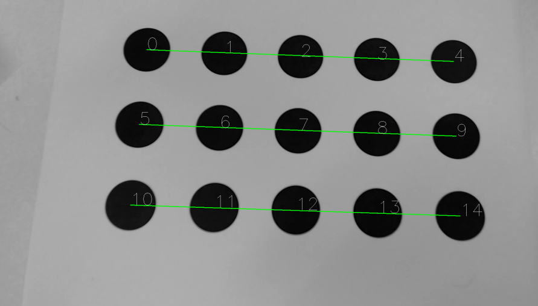

# Script for finding ellipses in image;
This Script find ellipses and find a pattern of grouped ellipses in a image
ideal to calculate the Homography of a plane.

## Requeriments:
  - OpenCV
  - Numpy

## Result:
  